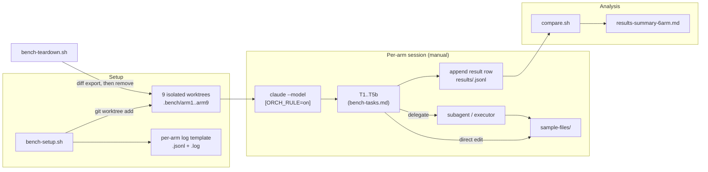
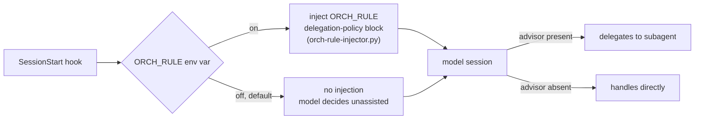

# orchestration-bench

  

[github.com/alexxony/orchestration-bench](https://github.com/alexxony/orchestration-bench)

*Measures whether Claude Code actually delegates to subagents, and under
which of three conditions (session structure, model tier, advisor
instruction) it does — companion harness to
[`claude-delegation-policy`](https://github.com/alexxony/claude-delegation-policy),
the ORCH_RULE advisor rule this benchmark tests.*

## 1. What this is

A git-worktree harness that runs the **same 6-task set across 9 isolated
Claude Code sessions**, each with a different combination of structure
(single session vs. orchestrator+executor), model tier (Sonnet / Opus /
Fable), and advisor instruction (`ORCH_RULE` on/off) — then diffs the
outcomes.

- **54 task executions, 0 script errors, delegation in exactly 3.**
- Delegation happened *only* when an explicit advisor instruction was
  present (`ORCH_RULE=on`) — never from structure or model tier alone,
  even when the model itself was the orchestrator (arm7/arm8: Opus/Fable
  as orchestrator, 0/6 each).
- When delegation *did* fire, it cost more than doing the task directly:
  the Fable-orchestrated arm spent **~4.1× the subagent tokens** of the
  Sonnet-orchestrated arm for roughly 2× the delegation count
  (1,458,380 vs. 356,325 tokens).
- A 10×-outlier task duration that looked like "model latency" in the
  first pass turned out, after an N=3 repeat and raw transcript
  timestamp analysis, to be **human bash-approval wait time** baked
  into the elapsed-time metric — not a model or advisor effect at all.

Full data: [`results-summary-6arm.md`](results-summary-6arm.md) (filename
predates the 9-arm expansion; kept for git history — content is current).

## 2. Why this is needed

This harness exists because of a real incident, not a hypothesis. The
original setup was `model=Sonnet` + Claude Code's built-in advisor
(Fable) — the advisor kept dropping mid-session during bash execution.
The workaround was to run **Fable as the main session model**
(orchestrator) with Sonnet doing the executing. That fixed the
disconnects but introduced a new, harder-to-pin-down problem: heavy
token consumption, and the orchestrator handling trivial edits itself
instead of delegating. It wasn't obvious whether that inefficiency came
from the orchestration *structure*, the *model tier*, or just the
absence of an explicit delegation instruction.

Three confounded variables can't be debugged by staring at one
production session, so this benchmark isolates them:

- **Factor separation, not a full factorial.** Structure, model, and
  advisor are each tested as an independent 2-cell contrast
  (baseline vs. treatment) against a shared baseline (arm1/3/5,
  repeated 3× for session-to-session noise, not statistical power on
  any single contrast). Crossing all three axes would confound results
  exactly like the original incident did — arm7/8/9 exist specifically
  to check the *combined* condition the user was actually running,
  outside the separated design.
- **Every claim is falsifiable against a logged transcript.** Each task
  execution writes a machine-readable `.jsonl` row (elapsed_sec,
  toolcalls, delegations, errors, diff stats) plus a free-text `.log` —
  self-reported claims are cross-checked against `git diff --stat` and,
  when a number looked wrong, against raw session JSONL timestamps
  (see the T4-anomaly finding below).
- **Negative and self-correcting results are kept, not filtered.** The
  original premise — "Fable-as-orchestrator wastes tokens because it
  does everything itself" — is *not* what arm8 (the direct
  reproduction) shows; the actual cost only appears once delegation is
  turned on (arm9). A wall-clock anomaly attributed to "model response
  latency" in the first write-up was later traced to a permission
  prompt and the hypothesis was retracted in place, with the repeat
  experiment that disproved it committed alongside it.

## 3. How it works





The second diagram is the actual load-bearing finding: structure and
model tier feed into the same session either way — only the
`ORCH_RULE` branch changed delegation behavior in 54/54 task runs.

### Repository layout

```
orchestration-bench/
├── bench-setup.sh                  # provisions the 9 arm worktrees (ARMS array)
├── bench-teardown.sh               # diff-exports + removes arm worktrees
├── bench-t4-repeat-setup.sh        # N=3 T4-only repeat harness (anomaly repro)
├── bench-t4-repeat-teardown.sh     # teardown for the above
├── bench-tasks.md                  # T1-T5b task definitions, run in order
├── sample-files/                   # dummy edit targets — not production code
├── results/                        # per-arm .log + .jsonl, compare.sh output
├── results-summary-6arm.md         # full 9-arm comparison (see note above on filename)
├── results-summary.md              # legacy 4-arm results (confounded, reference only)
├── docs/
│   ├── reinforcement-plan.md       # why 4-arm → 6-arm factor separation, cross-session leak finding
│   ├── incident-casebook.md
│   ├── orchestration-cost-model.md
│   └── verification-gates.md
└── hookify-rules/                  # local hook policies used during arm sessions
```

### Run

```bash
./bench-setup.sh
```

This creates one git worktree + branch per arm under `~/workspace/.bench/`.
Open a terminal per arm (or run sequentially — tasks are order-dependent,
T3 references T1/T2 output) and start the session with the arm's
configured model/advisor:

```bash
cd ~/workspace/.bench/<arm-name>
claude --model <sonnet|opus|fable>          # advisor off
ORCH_RULE=on claude --model <sonnet|opus|fable>   # advisor on
```

Paste `bench-tasks.md`'s T1→T5b instructions verbatim into the session.
Each task appends one row to `results/<arm-name>.jsonl` and a narrative
entry to `results/<arm-name>.log`.

```bash
./results/compare.sh              # regenerate the cross-arm comparison table
./bench-teardown.sh               # diff-export uncommitted work, remove worktrees
./bench-teardown.sh --purge-results   # also delete the result logs
```

## 4. Findings

| # | Finding | Evidence |
|---|---|---|
| 1 | Delegation never fires from structure or model tier alone — only from an explicit advisor instruction. | 0/48 non-advisor tasks delegate (arm1-5, arm7, arm8); 3/6 advisor-on tasks delegate (arm6, arm9) |
| 2 | The original "Fable wastes tokens by doing everything itself" premise is backwards. | arm8 (Fable orchestrator, advisor off) reproduces the original setup exactly: 0/6 delegation, no token anomaly |
| 3 | The real cost shows up only once delegation is *on* — and costs more per delegation on Fable than Sonnet. | arm9 subagent tokens 1,458,380 vs. arm6's 356,325 (~4.1×) for 2 vs. 1 delegations; possibly confounded by arm9 T4 task size — flagged, not yet isolated |
| 4 | A 1000s+ T4 duration outlier attributed to "model wall-clock latency" was a measurement artifact. | N=3 repeat + raw transcript timestamp analysis: the gap sits precisely between `PreToolUse:Bash` and `PostToolUse:Bash` — human permission-approval wait time, not model latency. Reproduced 3/3 on the arm it was structural to (arm4/Opus), 0/3 on the arm it first appeared on (arm6) — the original arm6 reading was a one-off, not a condition effect |
| 5 | A global hook plugin (`claude-smart`) observed and re-injected corrective rules across supposedly isolated benchmark sessions. | direct query of `~/.reflexio/data/reflexio.db`: 38 rules generated in real time during the arm1-6 run window — a session-isolation leak orthogonal to the three measured axes |

Every finding above is a link back to a specific table or paragraph in
[`results-summary-6arm.md`](results-summary-6arm.md); none of the
numbers here are restated from memory without a source row in that file
or in `results/*.jsonl`.

## 5. Known limitations (not yet fixed)

- **T5a/T5b's "increase read scope" manipulation is nullified when T2
  already loaded the same files** — observed independently in arm7, 8,
  and 9. A clean read of this task tier needs a fresh session, not a
  continuation of T1-T4.
- **`elapsed_sec` is unreliable for any task that triggers a bash
  permission prompt** (see Finding 4) — compare `diff`/`toolcalls`
  instead, or add a `--dangerously-skip-permissions` cell to isolate
  pure model latency in a future run.
- **The Fable-vs-Sonnet delegation cost ratio (Finding 3) is N=1 per
  arm** and not yet separated from task-size confounding.
- Global PreToolUse hooks inject guidance text into every call across
  all arms equally — this doesn't break relative arm comparisons, but
  means "no factor outside structure/model/advisor" is only true in an
  environment with those hooks enabled.

## License

MIT — see [`LICENSE`](LICENSE).
